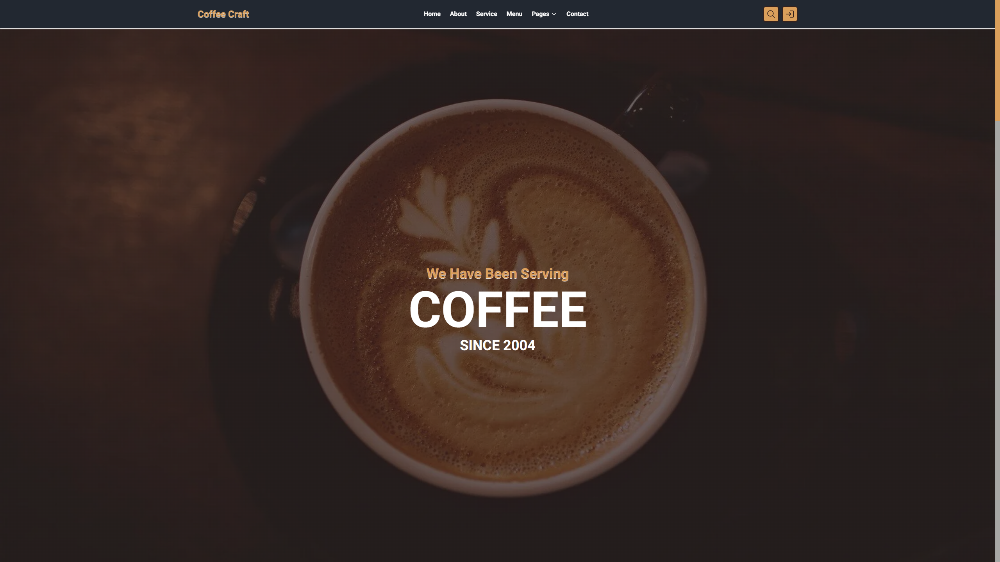
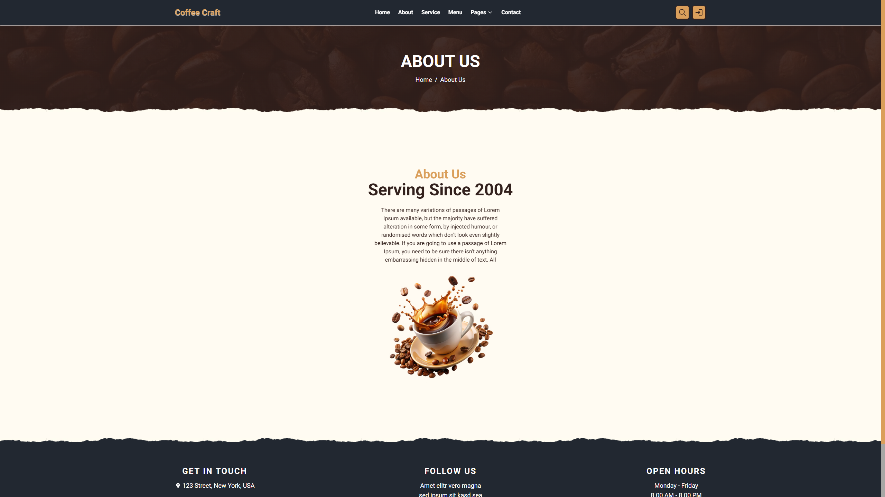
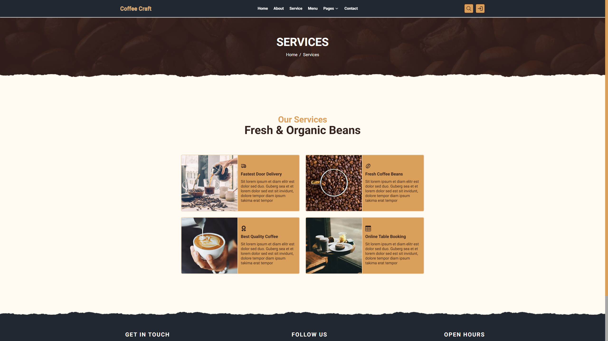
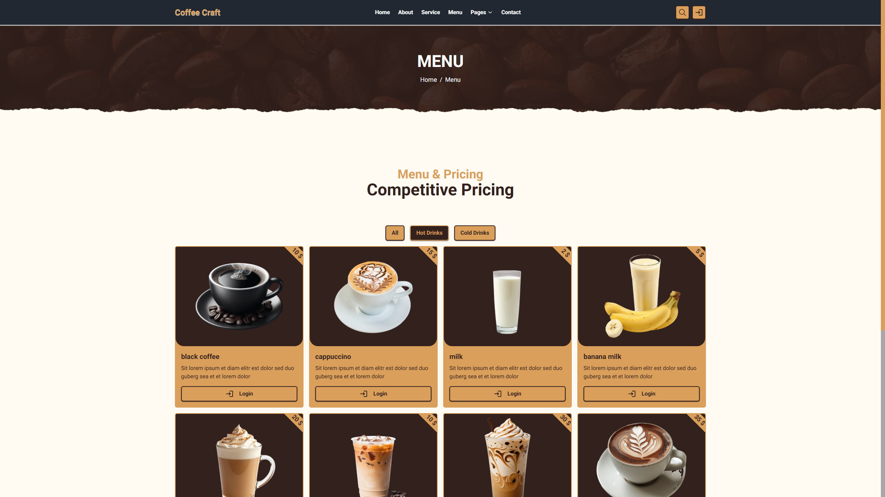
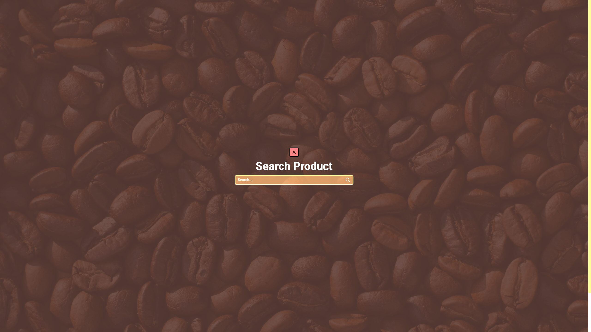
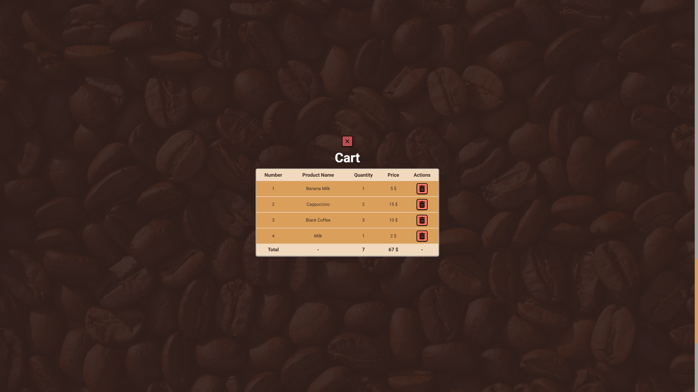
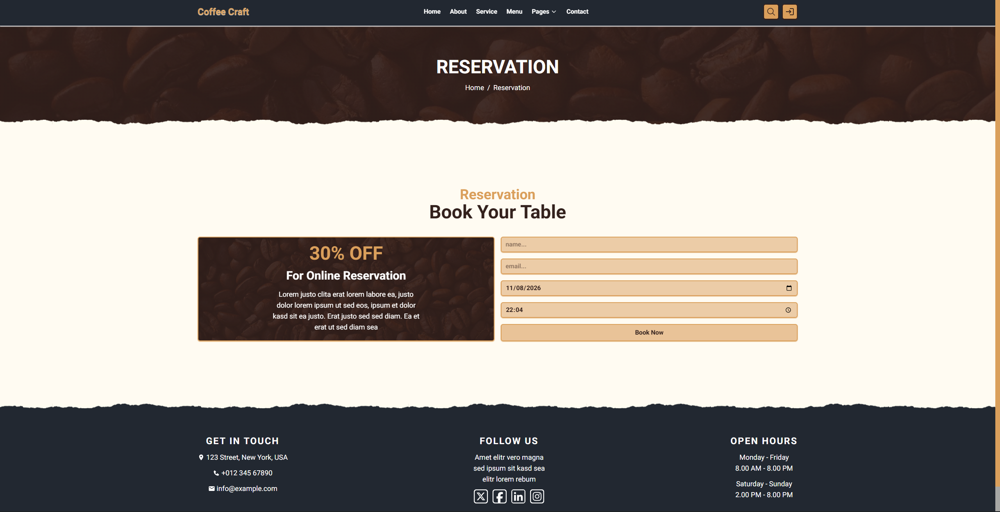
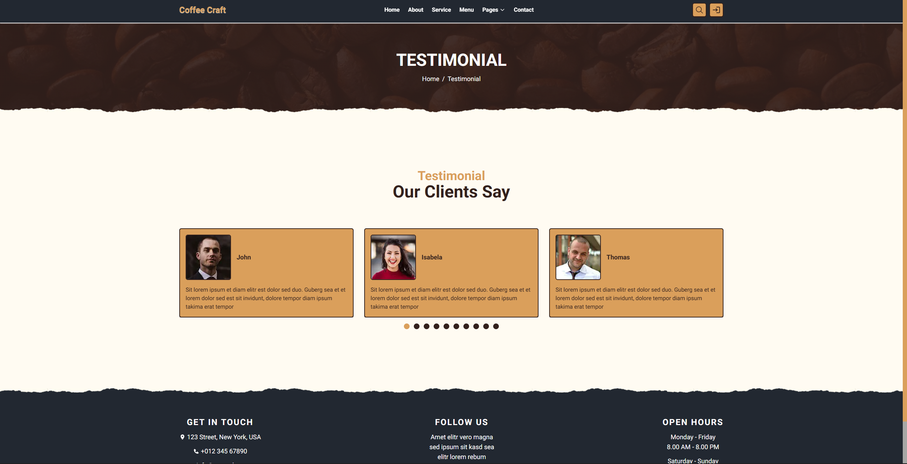
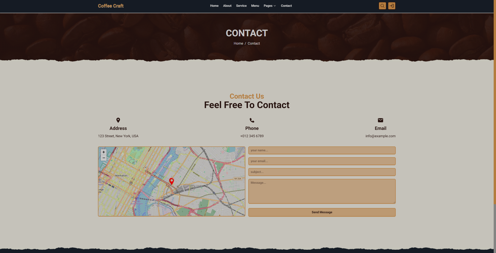
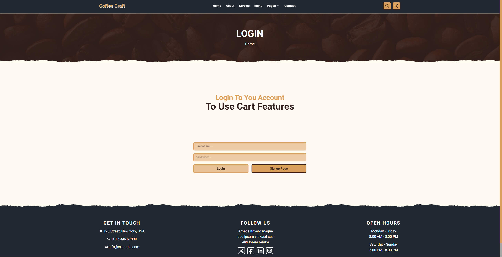

# ☕ Coffee Craft


> A modern, full-stack coffee shop web application built with Next.js, React, TypeScript, MongoDB, and Tailwind CSS.

Coffee Craft is a full-stack coffee shop platform designed to provide a complete online coffee-shop experience — from browsing products and filtering the menu to user authentication, shopping-cart management, table reservations, customer testimonials, newsletter subscriptions, and contact requests.

The application combines a responsive frontend with a server-side API layer and MongoDB persistence, while using reusable components, feature-based architecture, animations, form validation, and client-side state management to keep the project maintainable and scalable.

## 🚀 Demo

### Live Application

**[Coffee Craft — Live Demo](https://coffee-craft-green.vercel.app/)**

Explore the deployed application and try the different sections:

- 🏠 Home
- ℹ️ About
- ☕ Services
- 📋 Menu
- 🔎 Product Search
- 🛒 Shopping Cart
- 📅 Table Reservation
- 💬 Testimonials
- 📩 Contact
- 🔐 Login & Signup

The deployed application provides the same core experience implemented in the repository, including the menu, reservation flow, testimonials, search panel, and cart interface.

## 🛠️ Technologies

### Frontend

| Technology         | Purpose                                            |
| ------------------ | -------------------------------------------------- |
| **Next.js 15**     | React framework, routing, rendering and API routes |
| **React 19**       | UI development                                     |
| **TypeScript**     | Static typing                                      |
| **Tailwind CSS 4** | Utility-first styling                              |
| **React Icons**    | Interface icons                                    |
| **React Toastify** | Toast notifications                                |
| **Swiper**         | Sliders and carousels                              |
| **Leaflet**        | Interactive maps                                   |
| **React Leaflet**  | React integration for Leaflet                      |
| **GSAP**           | Animations and scroll-based interactions           |
| **@gsap/react**    | GSAP integration with React                        |

### Backend

| Technology             | Purpose               |
| ---------------------- | --------------------- |
| **Next.js API Routes** | Backend API layer     |
| **MongoDB**            | Application database  |
| **Mongoose**           | MongoDB ODM           |
| **Axios**              | HTTP requests         |
| **JWT**                | Authentication tokens |
| **bcrypt**             | Password hashing      |
| **cookie**             | HTTP cookie handling  |

### Validation & State

| Technology         | Purpose                      |
| ------------------ | ---------------------------- |
| **Yup**            | Request/form validation      |
| **Zustand**        | Client-side state management |
| **clsx**           | Conditional class names      |
| **tailwind-merge** | Safe Tailwind class merging  |

The project's dependency configuration includes Next.js 15.5.9, React 19.1.0, TypeScript 5, Tailwind CSS 4, Mongoose, Zustand, GSAP, Swiper, Leaflet, Axios, JWT, bcrypt, Yup and the other supporting libraries listed above.

## ✨ Features

### 🏠 Complete Coffee Shop Website

Coffee Craft provides a complete coffee-shop website rather than a single landing page.

The application includes:

- Home page
- About page
- Services page
- Menu page
- Individual product pages
- Reservation page
- Testimonial page
- Contact page
- Search page
- Login page
- Signup page
- Custom 404 page

The navigation and shared layout are handled through reusable components.

### ☕ Dynamic Product Menu

Products are stored in MongoDB and loaded through the application's data layer.

The menu supports:

- Product listing
- Product details
- Product categories
- Hot-drink filtering
- Cold-drink filtering
- Product search
- Dynamic product pages
- Add-to-cart functionality

The deployed menu currently exposes filters for **all**, **hot drinks**, and **cold drinks**.

### 🔎 Product Search

The application contains a dedicated search feature that allows users to search for products without leaving the current page.

The search functionality is implemented as its own feature with:

- Search components
- Search hooks
- Search state
- Search page
- Product filtering

### 🛒 Shopping Cart

Coffee Craft includes a complete cart feature.

The cart architecture is separated into:

- Cart components
- Cart hooks
- Cart stores
- Cart types
- Cart API endpoints

Users can interact with the cart through the shared cart panel and product interfaces.

### 🔐 Authentication

Coffee Craft implements its own authentication system using:

- Username/password authentication
- Password hashing with bcrypt
- JWT authentication
- HTTP-only cookies
- Authentication middleware/helpers
- Login
- Signup
- Logout
- Current-user authorization checking

The API also validates authentication tokens before accessing protected user information.

### 📅 Table Reservation

Visitors can use the reservation page to submit a table-booking request.

The application includes:

- Reservation form
- Input validation
- Reservation API
- Reservation MongoDB model
- Server-side persistence

The deployed reservation page presents the table-booking experience with an online reservation form.

### 💬 Testimonials & Comments

Customer comments are stored and retrieved from MongoDB.

The application provides:

- Testimonial listing
- Comment data model
- Comment API
- Product-specific comments
- User association
- Populated commenter information

The homepage also loads testimonials dynamically from the database.

### 📩 Newsletter Subscription

Coffee Craft provides a newsletter subscription form.

Submitted newsletter information is handled through a dedicated API endpoint and database model.

### 📬 Contact System

The contact page allows visitors to submit messages through a dedicated contact form.

The backend contains a dedicated contact API and MongoDB model for storing contact submissions.

### 🎞️ Animations

The application uses GSAP for interactive animations and scroll-based effects.

Animation logic is separated into reusable hooks, including:

- `useFadeUpAnimation`
- `usePanelAnimation`

GSAP's `ScrollTrigger` is also registered dynamically on the application level.

### 🖼️ Responsive UI

The interface is built using Tailwind CSS and responsive utility classes, allowing the layout to adapt to different screen sizes.

### 🔔 User Feedback

React Toastify is integrated globally to provide user feedback through toast notifications.

Notifications use:

- Slide transitions
- Automatic closing
- Focus-loss handling
- Drag interactions
- Configurable positioning

### 🗺️ Map Integration

Leaflet and React Leaflet are included for map-based functionality.

### 🧩 Reusable Component Architecture

The project separates reusable UI components from page-specific templates and feature-specific components.

The component structure includes:

```text
src/
├── animations/
├── components/
│   ├── templates/
│   └── ui/
├── database/
├── features/
├── models/
├── pages/
├── styles/
├── types/
├── utils/
└── validations/
```

This separation makes individual features easier to maintain and extend.

## 🗄️ Database

Coffee Craft uses **MongoDB** through **Mongoose**.

The database connection is centralized in:

```text
src/database/dbConnection.ts
```

The project uses Mongoose models for several application entities:

```text
models/
├── Cart.ts
├── Comment.ts
├── Contact.ts
├── Newsletter.ts
├── Product.ts
├── Reservation.ts
├── Service.ts
└── User.ts
```

The production deployment can therefore connect to a MongoDB Atlas cluster through the configured environment variable without exposing database credentials in the repository.

## 🔌 API

The project uses Next.js API Routes as its backend.

The API is organized by feature:

```text
/api
├── auth
│   ├── index
│   ├── login
│   ├── logout
│   └── signup
├── cart
├── comments
├── contact
├── newsletter
├── products
├── reservation
└── services
```

This allows the frontend and backend to live inside the same Next.js application while keeping API responsibilities separated by domain.

## 🏗️ Architecture

Coffee Craft follows a feature-oriented architecture.

### `components/`

Contains reusable presentation components.

```text
components/
├── templates/
│   ├── about/
│   ├── contact/
│   ├── index/
│   ├── menu/
│   ├── reservation/
│   ├── services/
│   ├── single-product/
│   └── testimonial/
│
└── ui/
    ├── alert/
    ├── button/
    ├── comment-card/
    ├── footer/
    ├── header/
    ├── input/
    ├── page-breadcrumb/
    ├── product-card/
    ├── section-header/
    └── service-card/
```

### `features/`

Contains business-focused functionality.

```text
features/
├── auth/
├── cart/
├── menu-filter/
├── search/
└── slider/
```

Each feature can contain its own components, hooks, stores, types and supporting logic.

### `models/`

Contains Mongoose database models.

### `database/`

Contains database connection logic.

### `pages/`

Contains Next.js pages and API routes.

### `utils/`

Contains reusable utilities for:

- Axios
- Authentication token checking
- bcrypt operations
- JWT operations
- JSON parsing
- Dynamic icon loading
- Validation helpers

### `validations/`

Contains reusable validation definitions.

### `types/`

Contains shared TypeScript types.

### `animations/`

Contains reusable animation hooks.

## ⚙️ Scripts & Development

Install the project dependencies:

```bash
npm install
```

Start the development server:

```bash
npm run dev
```

The development server runs using Next.js with Turbopack.

Create a production build:

```bash
npm run build
```

Start the production server:

```bash
npm run start
```

Run ESLint:

```bash
npm run lint
```

### Available Scripts

| Script  | Command                  | Description                   |
| ------- | ------------------------ | ----------------------------- |
| `dev`   | `next dev --turbopack`   | Starts the development server |
| `build` | `next build --turbopack` | Creates the production build  |
| `start` | `next start`             | Starts the production server  |
| `lint`  | `eslint`                 | Runs ESLint                   |

## 🔑 Environment Variables

The application requires environment variables for private configuration.

## 📝 Notes

### Static Homepage Data

The homepage uses Next.js `getStaticProps` to load:

- Services
- Products
- Comments

The generated page is configured with a **24-hour revalidation period**, allowing the homepage data to be regenerated periodically without requiring a full rebuild for every request.

### Authentication Cookies

Authentication tokens are stored using HTTP cookies with `httpOnly` enabled, reducing direct client-side access to the token.

### Shared UI

The header, footer, search panel, cart panel, and toast container are mounted globally through `_app.tsx`, making them available throughout the application.

### TypeScript

The project uses TypeScript throughout the application and includes dedicated type definitions for application entities and feature-specific data.

## 📸 Preview

### Home



### About



### Services



### Menu



### Product Search



### Shopping Cart



### Table Reservation



### Testimonials



### Contact



### Login & Signup



## 📂 Project Structure

```text
Coffee-Craft/
│
├── public/
│   └── image/
│       ├── comments/
│       ├── products/
│       ├── services/
│       ├── about-background.jpg
│       ├── coffee-background.webp
│       ├── coffee-beans.webp
│       ├── coffeeBean-bag.png
│       ├── flying-coffee-cup.png
│       ├── index-slide-1.webp
│       ├── index-slide-2.webp
│       ├── location-icon.webp
│       ├── not-found.png
│       ├── paper-torn-piece-bottom.webp
│       ├── paper-torn-piece-top.webp
│       └── testimonial-image.png
│
├── src/
│   ├── animations/
│   ├── components/
│   │   ├── templates/
│   │   └── ui/
│   ├── database/
│   ├── features/
│   │   ├── auth/
│   │   ├── cart/
│   │   ├── menu-filter/
│   │   ├── search/
│   │   └── slider/
│   ├── models/
│   ├── pages/
│   │   ├── api/
│   │   ├── about/
│   │   ├── contact/
│   │   ├── menu/
│   │   ├── product/
│   │   ├── reservation/
│   │   ├── search/
│   │   ├── services/
│   │   └── testimonial/
│   ├── styles/
│   ├── types/
│   ├── utils/
│   └── validations/
│
├── .gitignore
├── eslint.config.mjs
├── next.config.ts
├── package.json
├── package-lock.json
├── postcss.config.mjs
└── tsconfig.json
```

## 🎯 Project Highlights

Coffee Craft demonstrates a number of modern full-stack development concepts:

- Full-stack Next.js architecture
- React component architecture
- TypeScript
- MongoDB + Mongoose
- REST-style API routes
- JWT authentication
- HTTP-only cookies
- Password hashing
- Zustand state management
- Form validation
- Product search
- Product filtering
- Shopping cart
- Reservations
- Newsletter subscriptions
- Contact submissions
- Dynamic product pages
- Server-side database queries
- Static generation with revalidation
- GSAP animations
- Responsive Tailwind CSS
- Reusable UI components
- Feature-based project organization
- Client/server separation
- Production deployment with Vercel

## 🌐 Deployment

The application is deployed with Vercel and is connected to its production configuration through environment variables.

**Live:** https://coffee-craft-green.vercel.app/

**Repository:** https://github.com/Ali-boorboor/Coffee-Craft

---

Made with ❤️ and ☕ by **Ali Boorboor**

⭐ If you found the project useful or interesting, consider giving the repository a star.
